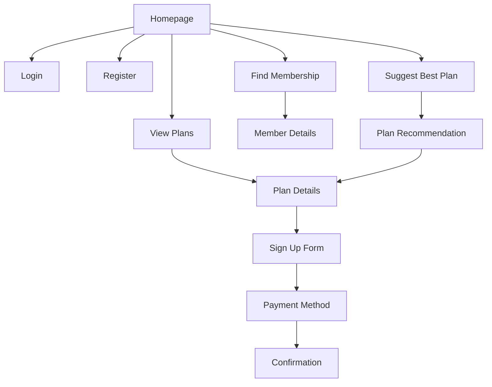
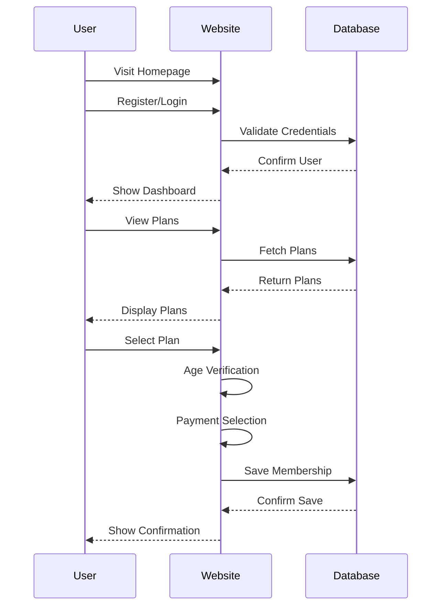
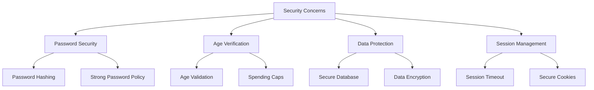
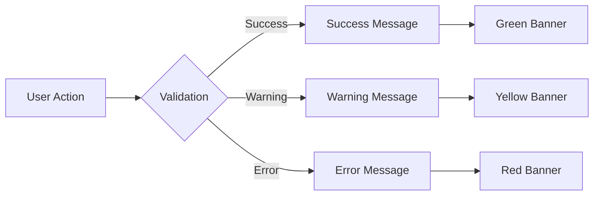
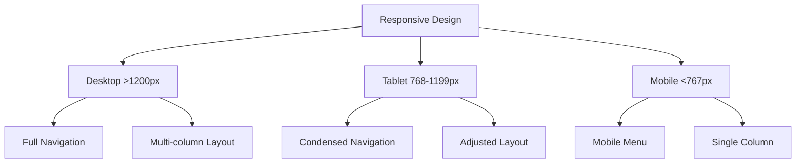

# Website Design Documentation

## 1. Site Structure Diagram

## 2. User Flow Diagram

## 3. Required Outcomes Analysis

### a) Meeting Required Outcomes
- ✅ User Registration & Authentication
- ✅ Plan Selection and Comparison
- ✅ Age Restriction Implementation
- ✅ Payment Method Selection
- ✅ Membership Management
- ✅ Best Plan Suggestion

## 4. Security Concerns & Solutions

## 5. Aesthetics & UI/UX Planning

### Time Allocation (100 hours total)
- Core Functionality: 50%
- UI/UX Design: 30%
- Testing: 20%

### Design Priorities
1. Responsive Design
2. Clear Navigation
3. Consistent Branding
4. User-Friendly Forms
5. Mobile Compatibility

## 6. User Message System

### Types of Messages
1. **Success Messages** (Green)
   - Registration successful
   - Login successful
   - Plan selection confirmed
   - Payment method saved

2. **Warning Messages** (Yellow)
   - Age restrictions applied
   - Session timeout warning
   - Spending cap notification

3. **Error Messages** (Red)
   - Invalid login
   - Age verification failed
   - Invalid input data
   - System errors

### Message Implementation

## 7. Responsive Design Breakpoints

## 8. Testing Strategy

### Areas to Test
1. User Registration/Login
2. Plan Selection
3. Age Verification
4. Payment Process
5. Responsive Design
6. Error Handling
7. Security Features

### Testing Methods
- Unit Testing
- Integration Testing
- User Acceptance Testing
- Security Testing
- Mobile Testing 